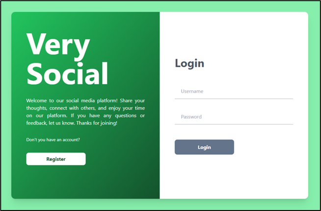
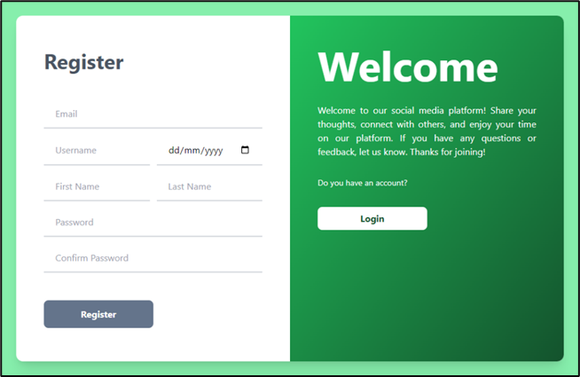
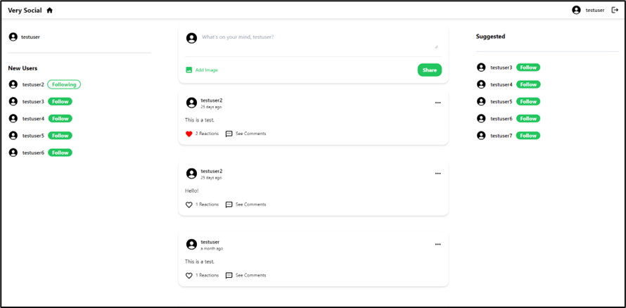
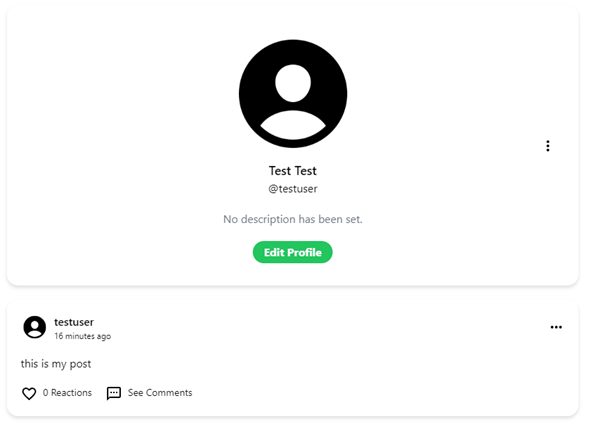
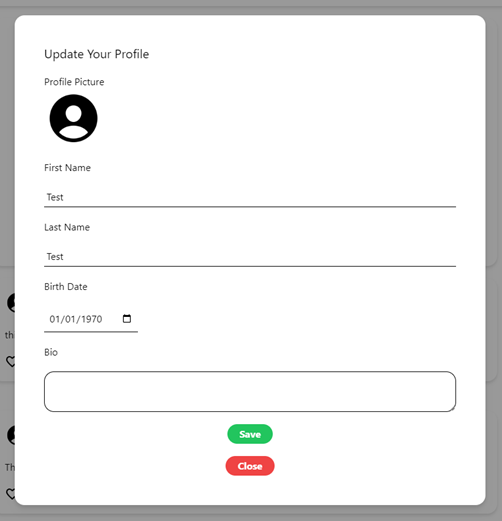

# Full Stack Social Media Platform

## Home page

## Feed

## Profile

## Start dev server

1. You need to configure the API's `.env` file based on the `.example.env` file in the `src/api/`
2. Start the docker containers from the root folder with `docker-compse up` command
